# Material Design in Adobe Substance 3D Painter

This repository presents a collection of material creation and texture painting projects completed in **Adobe Substance 3D Painter** and **Adobe Photoshop** . Each asset demonstrates the workflow from 3D model preparation to texture creation and the final rendered result.

---

## Software

- Adobe Substance 3D Painter
- Autodesk 3ds Max
- Adobe Photoshop

---

## Skills Demonstrated

- Material Creation
- Texture Painting
- Physically Based Rendering (PBR)
- UV Mapping
- Asset Texturing
- Surface Detail Creation

---

# Rubik's Cube

| Modeling | UV Mapping | Final |
|----------|----------|-------|
| 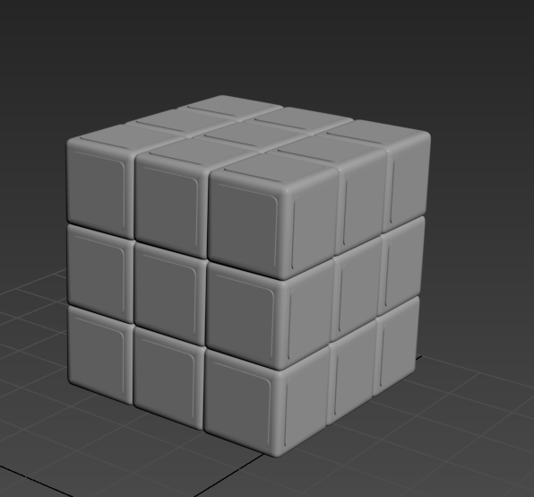 | 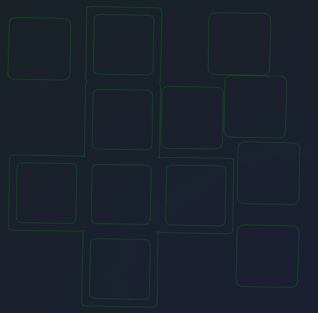 | 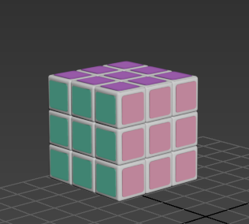 |

---

# Bird

| Modeling | Texture | Final |
|----------|----------|-------|
| 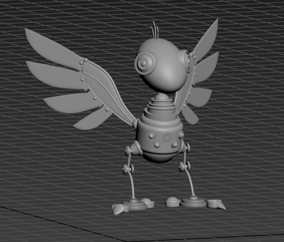 | 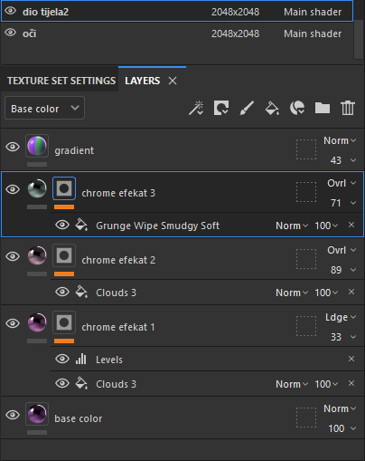 | 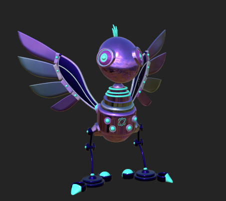 |

---

# Frog

| Modeling | Texture | Final |
|----------|----------|-------|
| 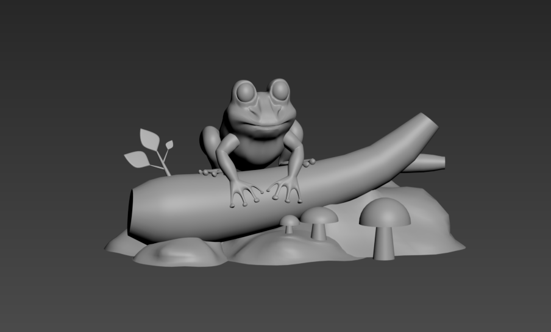 | 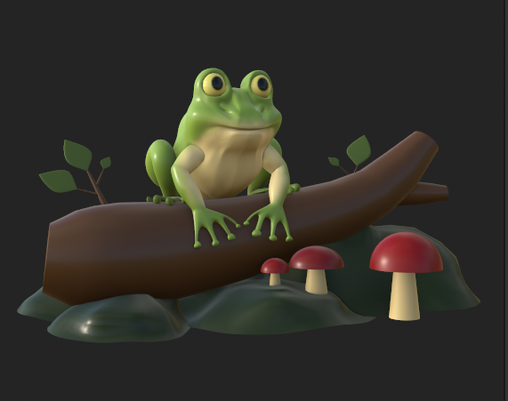 | 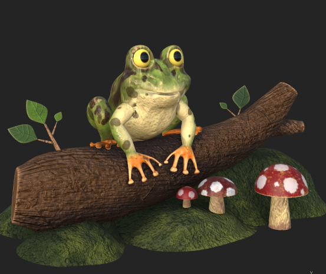 |

---

# Ice Cream

| Modeling | UV Mapping | Final |
|----------|----|-------|
| 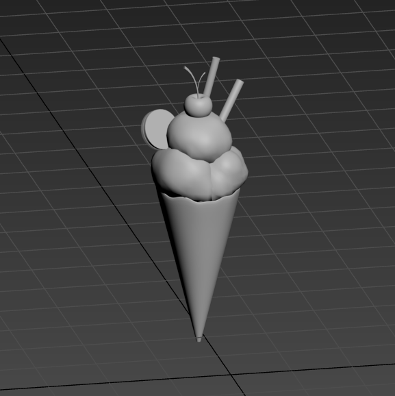 | 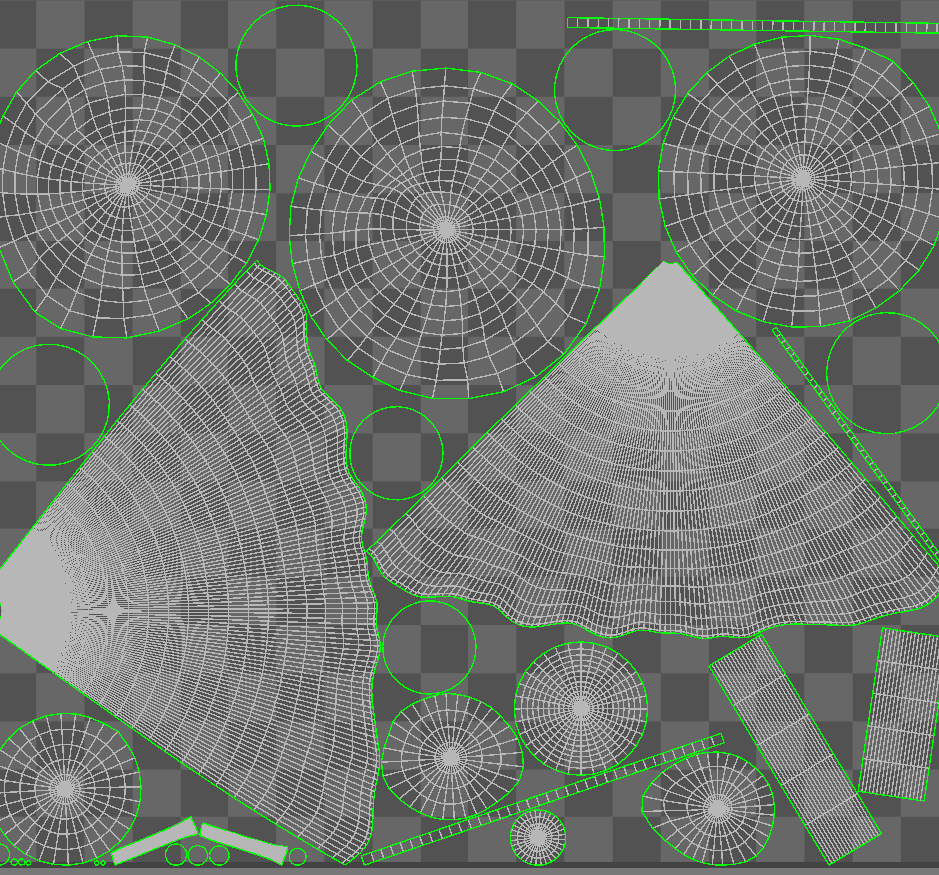 | 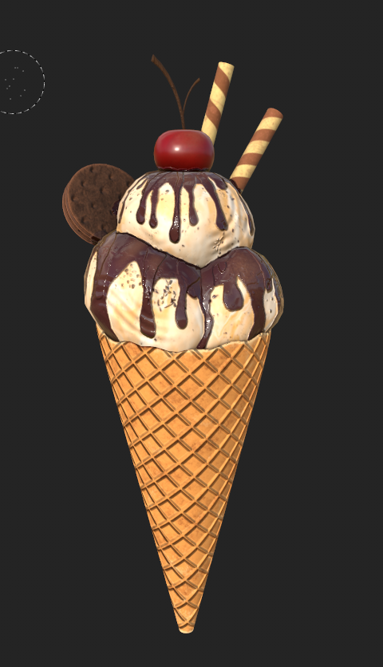 |

---

# Pressure Cooker

| Modeling | UV Mapping | Final |
|----------|----------|-------|
| 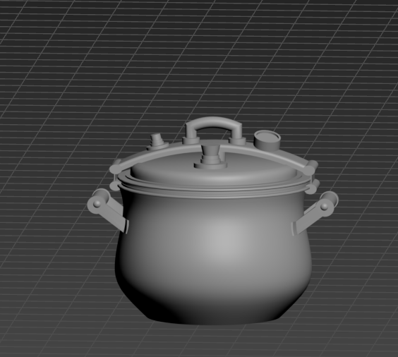 | 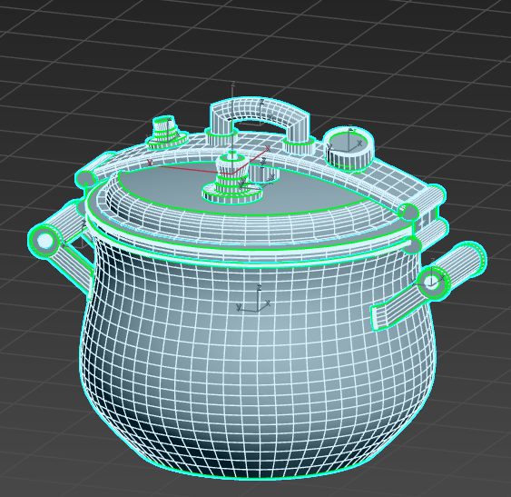 | 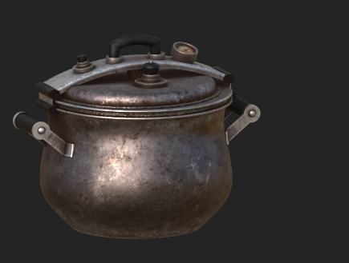 |

---

# Fire Extinguisher

| Modeling | UV Mapping | Final |
|----------|----------|-------|
| 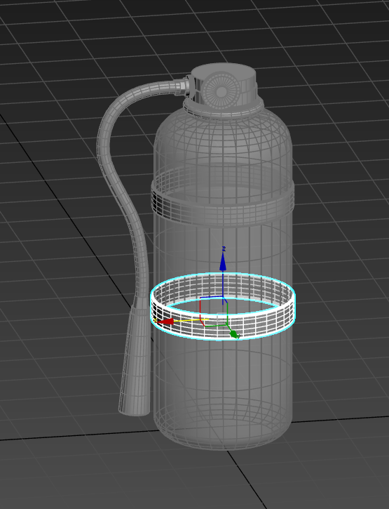 | 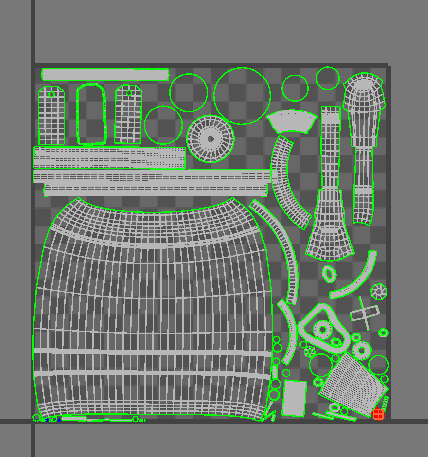 | 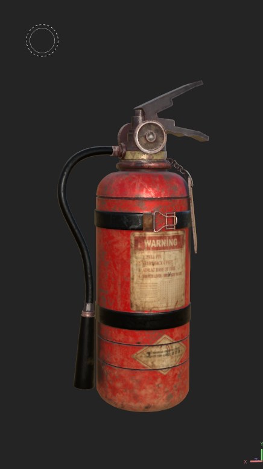 |

---

# Pyramid

| Modeling | Texture | Final |
|----------|----------|-------|
| 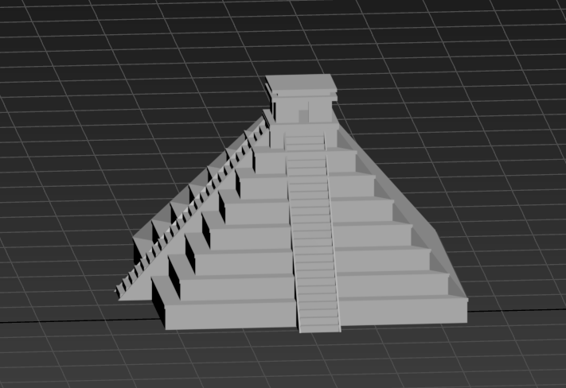 | 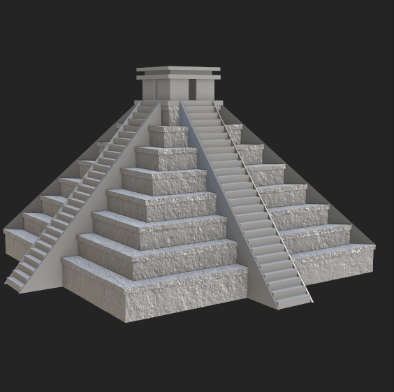 | 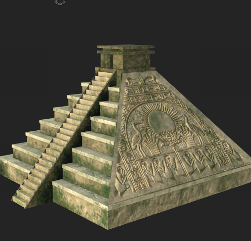 |

---

## Workflow

The project demonstrates the complete material creation workflow:

- 3D Modeling
- Asset preparation
- UV mapping
- Material authoring
- Texture painting
- Surface refinement
- Final presentation

---

## Author

**Nataša Todorović**

Animation Engineering & Computer Graphics Student

Faculty of Technical Sciences, University of Novi Sad
